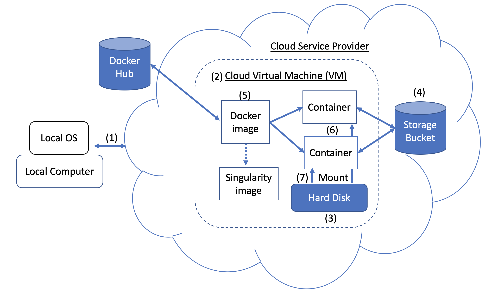

# Official NCBI BLAST+ Docker image

This repository contains documentation for the [NCBI BLAST+](https://www.ncbi.nlm.nih.gov/pubmed/2231712) command line applications in a Docker image.  We will demonstrate how to use the Docker image to run BLAST analysis on the Google Cloud Platform using a basic example and a more advanced use case.  Some basic knowledge of Unix/Linux commands and BLAST+ is useful in completing this tutorial.  
  
***This is only a preview draft of the documentation. Please continue to check this site for the latest updates!***

## Table of Contents

   * [What is NCBI BLAST?](#what-is-ncbi-blast)
   * [Getting Started](#getting-started)
       * [What is cloud computing?](#what-is-cloud-computing)
       * [What is Docker?](#what-is-docker)
   * [Quick Start Guide – A small example](#quick-start-guide--a-small-example)     
   * [Before you start](#before-you-start)  
   * [A Step-by-Step Guide using Docker and BLAST](#a-step-by-step-guide-using-docker-and-blast)
       * [Step 1. Install Docker](#step-1-install-docker)
       * [Step 2. Import sequences and create a BLAST database](#step-2-import-sequences-and-create-a-blast-database)
       * [Step 3. Run BLAST](#step-3-run-blast)
       * [Stop the GCP instance](#stop-the-gcp-instance)
   * [Advanced Use Case](#advanced-use-case)
       * [BLAST+ Docker image benchmarks](#blast-docker-image-benchmarks)
       * [Commands](#commands)
   * [Additional Resources](#additional-resources)
   * [Maintainer](#maintainer)
   * [License](#license)
   * [Appendix](#appendix)
       * [Appendix A. Cloud and Docker Concepts](#appendix-a-cloud-and-docker-concepts)
       * [Appendix B. Transfer files to/from a GCP VM](#appendix-b-transfer-files-tofrom-a-gcp-vm)

# What is NCBI BLAST?

  


The National Center for Biotechnology Information (NCBI) Basic Local Alignment Search Tool [(BLAST)]( https://blast.ncbi.nlm.nih.gov) finds regions of local similarity between sequences. The program compares nucleotide or protein sequences to sequence databases and calculates the statistical significance of matches. BLAST can be used to infer functional and evolutionary relationships between sequences as well as help identify members of gene families.

Introduced in 2009, BLAST+ is an improved version of BLAST command line applications.  For a full description of the features and capabilities of BLAST+, please refer to the [BLAST Command Line Applications User Manual](https://www.ncbi.nlm.nih.gov/books/NBK279690/).

# Getting Started

## What is cloud computing?
Cloud computing offers potential cost savings by using on-demand, scalable, and elastic computational resources. While a detailed description of various cloud technologies and benefits is out of the scope for this repository, the following sections contain information needed to get started running the BLAST+ Docker image on the Google Cloud Platform [(GCP)]( https://cloud.google.com/).  

## What is Docker?
[Docker](https://www.docker.com/) is a tool to perform operating-system level virtualization using software containers. In containerization technology<sup>*</sup>, an image is a snapshot of an analytical environment encapsulating application(s) and dependencies. An image, which is essentially a file build from a list of instructions, can be saved and easily shared for others to recreate the exact analytical environment across platforms and operating systems. A container is a runtime instance of an image. By using containerization, users can bypass the often-complicated steps in compiling, configuring and installing a Unix-based tool like BLAST+. In addition to portability, containerization is a light-weight approach to make analysis more findable, accessible, interoperable, reusable (F.A.I.R.) and, ultimately, reproducible.  

*There are many containerization tools and standards, such as [Docker](https://www.docker.com/) and [Singularity]( https://www.sylabs.io/singularity/). We will focus solely on Docker, which is considered the de facto standard by many in the field.  
  
# Quick Start Guide – A small example
   
This section provides a quick run-through of a BLAST analysis using a very small sample query, a small custom database and the Protein Data Bank (PDB) protein database. If you are already familiar with the basics of cloud computing and Docker, you can run the entire analysis in this section.  More detailed descriptions of analysis steps, alternative commands and  more advanced topics are covered in the remaining sections of this documentation.  
  
Input data 
* Query – 1 sequence, 44 nucleotides, file size 0.2 KB
* Databases
    * 7 sequences, 922 nucleotides, file size 1.7 KB
    * PDB protein database (pdb_v5) 0.2945 GB 

Compute resources  
  
To use the following compute resources, you need to sign in at [Google Cloud Platform Console](https://console.cloud.google.com/).  Upon signing in, GCP automatically creates the first project called “My First Project.”

[Google Cloud Shell](https://cloud.google.com/shell/docs/features) is an interactive shell environment using a g1-small VM with Docker pre-installed but is subject to [usage limitations](https://cloud.google.com/shell/docs/limitations).  While it is designed as a tool to manage resources on the GCP, it can be used to run the following small example without having to set up a billing account.  Follow [these steps](https://cloud.google.com/shell/docs/starting-cloud-shell) to start a Cloud Shell session.
  
As an alternative, this section can be completed using a GCP f1-micro [free-tier](https://cloud.google.com/free/) instance.  Detailed description for setting up the VM is described in the [next section.](#before-you-start) For this example, you can use an f1-micro VM running Ubuntu 18.04 LTS in the us-east region. After creating the instance, click "SSH" in the GCP console to [connect to the instance](https://cloud.google.com/compute/docs/ssh-in-browser) from the browser.   
  
You can run commands in this respository by using copy-and-paste.  In Windows or Unix/Linux, use the keyboard shortcut `Control+C` to copy and `Control+V` to paste.  On a Mac, use `Command+C` to copy and `Command+V` to paste.
   
```
# Time needed to complete this section: <10 minutes

# Step 1. Install Docker
# This step is optional if using the Cloud Shell
sudo snap install docker
sudo apt update
sudo apt install -y docker.io
sudo usermod -aG docker $USER
exit
# exit and SSH back in for changes to take effect

# Step 2. Retrieve sequences
## Create directories for analysis
cd ; mkdir blastdb queries fasta results blastdb_custom

## Retrieve query sequence
docker run --rm ncbi/blast efetch -db protein -format fasta \
    -id P01349 > queries/P01349.fsa
    
## Retrieve database sequences
docker run --rm ncbi/blast efetch -db protein -format fasta \
    -id Q90523,P80049,P83981,P83982,P83983,P83977,P83984,P83985,P27950 \
    > fasta/nurse-shark-proteins.fsa
    
## Make BLAST database 
docker run --rm \
    -v $HOME/blastdb_custom:/blast/blastdb_custom:rw \
    -v $HOME/fasta:/blast/fasta:ro \
    -w /blast/blastdb_custom \
    ncbi/blast \
    makeblastdb -in /blast/fasta/nurse-shark-proteins.fsa -dbtype prot \
    -parse_seqids -out nurse-shark-proteins -title "Nurse shark proteins" \
    -taxid 7801 -blastdb_version 5
    
## Step 3. Run BLAST+ 
docker run --rm \
    -v $HOME/blastdb:/blast/blastdb:ro \
    -v $HOME/blastdb_custom:/blast/blastdb_custom:ro \
    -v $HOME/queries:/blast/queries:ro \
    -v $HOME/results:/blast/results:rw \
    ncbi/blast \
    blastp -query /blast/queries/P01349.fsa -db nurse-shark-proteins
    
## Ouput on screen
## Scroll up to see the entire output
```
  
At this point, you should see the output on the screen. With your query, BLAST identified the protein sequence P80049.1 as a match with a score of 14.2 and an E-value of 0.96.  
  
For larger analysis, it is recommended to use the `-out` flag to save the output to a file.  For example, append `-out /blast/results/blastp.out` to the last command in Step 3 above and visualize the content of this output file using `cat $HOME/results/blastp.out`.  

You can also query P01349.fsa against the PDB as shown in the following code block.

```
## Extend the example to query against the Protein Data Bank
## Time needed to complete this section: <10 minutes

## Confirm query
ls queries/P01349.fsa

## Display databases available for download from the GCP
docker run --rm ncbi/blast update_blastdb.pl --showall pretty --source gcp

## Download Protein Data Bank Version 5 database (pdb_v5)
docker run --rm \
     -v $HOME/blastdb:/blast/blastdb:rw \
     -w /blast/blastdb \
     ncbi/blast \
     update_blastdb.pl --source gcp pdb_v5

## Run BLAST+ 
docker run --rm \
     -v $HOME/blastdb:/blast/blastdb:ro \
     -v $HOME/blastdb_custom:/blast/blastdb_custom:ro \
     -v $HOME/queries:/blast/queries:ro \
     -v $HOME/results:/blast/results:rw \
     ncbi/blast \
     blastp -query /blast/queries/P01349.fsa -db pdb_v5

## Ouput on screen
## Scroll up to see the entire output
```
   
Remember to [stop](https://cloud.google.com/compute/docs/instances/stop-start-instance) or [delete](https://cloud.google.com/compute/docs/instances/stop-start-instance) the VM to prevent incurring additional cost.  
  

## Before you start
* System requirements
    * A GCP virtual machine (VM) running **Ubuntu 18.04LTS**.  
    * Advanced use case - recommended system requirements: 16 CPUs, >=60GB memory and 200GB hard disk space. (Please refer to the [benchmark](#blast-docker-image-benchmarks) section below and pages 13-15 in this [NCBI presentation](https://ftp.ncbi.nlm.nih.gov/pub/education/public_webinars/2018/10Oct03_Using_BLAST/Using_BLAST_Well2.pdf)). 

*Please note: Docker is not available on many high-performance computing (HPC) resources, such as the NIH [Biowulf.](https://hpc.nih.gov/systems/) Consult your system administrator if you intend to run this tutorial on HPC.*    

* Software requirements
    * Docker (In our test, version 18.09.2 was installed by Ubuntu's package manager as described below)
    
* Architecture
    * BLAST+ supports AMD64 architecture.

Steps to create a VM on the GCP - 
1. Sign up for a Google account, if you don't have one.  
2. Sign in at [Google Cloud Platform Console](https://console.cloud.google.com/).  
GCP automatically creates the first project called “My First Project.”
3. Create a [billing account.](https://cloud.google.com/billing/docs/how-to/manage-billing-account)  
*Please note: GCP offers credits and free resources for users. Please refer to [GCP Free Tier](https://cloud.google.com/free/).*
4. Create a Compute Engine [VM instance](https://cloud.google.com/compute/docs/quickstart-linux) with Ubuntu 18.04 LTS.

Detailed instructions for creating a GCP account and launching a VM can be found [here.](https://cloud.google.com/compute/docs/quickstart-linux) 
  
*Creating a VM in the same region as storage can provide better performance. We recommend creating a VM in the us-east region.*  
  
*Please note: if you have a job that will take several hours, but less than 24 hours, you can potentially take advantage of [preemptible VMs](https://cloud.google.com/compute/docs/instances/preemptible), which cost much less.*  

Remember to [stop](https://cloud.google.com/compute/docs/instances/stop-start-instance) or [delete](https://cloud.google.com/compute/docs/instances/stop-start-instance) the VM to prevent incurring additional cost.    
    
# A Step-by-Step Guide using Docker and BLAST
In this section, we will cover Docker installation, discuss various `docker run` command options, and examine the structure of a Docker command.  We will use the same basic example and explore alternative approaches in running the BLAST+ Docker image.

Input data
* Query – 1 sequence, 44 nucleotides, file size 0.2 KB
* Database – 7 sequences, 922 nucleotides, file size 1.7 KB

This section can be completed using the Google Cloud Shell](https://cloud.google.com/shell/docs/features) or a GCP f1-micro [free-tier](https://cloud.google.com/free/) instance.
  
## Step 1. Install Docker
```
## Run these commands to install Docker and add non-root users to run Docker
## This step is optional if using the Cloud Shell
sudo snap install docker
sudo apt update
sudo apt install -y docker.io
sudo usermod -aG docker $USER
exit
# exit and SSH back in for changes to take effect
```
If Docker has been installed correctly, the command `docker run hello-world` should produce ["Hello from Docker! ..."](https://docs.docker.com/samples/library/hello-world/)  
  
### Docker command options
*This section is optional.*    
  
Below is a list of `docker run` command line [options](https://docs.docker.com/engine/reference/commandline/run/) used in this tutorial.

| Name, short-hand(if available) | Description |
| :----------------------------  | :---------- |
|`--rm`|Automatically remove the container when it exits|
|`--volume` , `-v`|Bind mount a volume|
|`--workdir` , `-w`| Working directory inside the container|

### Docker command structure
*This section is optional.*  
  
For this tutorial, it would be useful to understand the structure of a Docker command.  

```
docker run --rm ncbi/blast \

    -v $HOME/blastdb_custom:/blast/blastdb_custom:rw \
    -v $HOME/fasta:/blast/fasta:ro \
    -w /blast/blastdb_custom \

    makeblastdb -in /blast/fasta/nurse-shark-proteins.fsa -dbtype prot \
    -parse_seqids -out nurse-shark-proteins -title "Nurse shark proteins" \
    -taxid 7801 -blastdb_version 5
```
  
The first part of the command `docker run --rm ncbi/blast` is an instruction to run the docker image `ncbi/blast` and remove the container when the run is completed.  
  
The second part of the command makes the query sequence data accessible in the container. [Docker bind mounts]( https://docs.docker.com/storage/bind-mounts/) uses `-v` to mount the local directories to directories inside the container and provide access permission rw (read and write) or ro (read only). For instance, assuming your query sequences are stored in the $HOME/fasta directory on the local host, you can use the following parameter to make that directory accessible inside the container in /blast/fasta as a read-only directory `-v $HOME/fasta:/blast/fasta:ro`.  
  
The third part of the command is the BLAST+ command. In this case, it is executing makeblastdb to create BLAST database files.  
  
You can start an interactive bash session for this image by using `docker run -it ncbi/blast /bin/bash`. For the BLAST+ Docker image, the executables are in the folder /blast/bin and /root/edirect and added to the variable $PATH.  
  
For additional documentation on the `docker run` command, please refer to [documentation](https://docs.docker.com/engine/reference/commandline/run/).  
  
### Useful Docker commands
*This section is optional.*  
  
```
# Show a list of containers
docker ps -a

# Remove all exited containers, if you have at least 1 exited container from the command above
docker rm $(docker ps -q -f status=exited)

# Remove a docker container
docker rm <CONTAINER_ID>

# Show a list of images
docker images

# Remove the ncbi/blast image
docker rmi ncbi/blast
```  
  
### Using BLAST+ with Docker
*This section is optional.*    
  
With this Docker image you can run BLAST+ in an isolated container, facilitating reproducibility of BLAST results. As a user of this Docker image, you are expected to provide BLAST databases and query sequence(s) to run BLAST
as well as a location outside the container to save the results. The following is a list of directories used by BLAST+.

| Directory | Purpose | Notes |
| --------- | ------  | ----- |
| `$HOME/blastdb` | Stores NCBI provided BLAST databases | If set to a _single, absolute_ path, the `$BLASTDB` environment variable could be used instead (see [Configuring BLAST via environment variables](https://www.ncbi.nlm.nih.gov/books/NBK279695/#_usermanual_Configuring_BLAST_via_environ_).) |
| `$HOME/queries` | Stores user provided query sequence(s) | |
| `$HOME/fasta`   | Stores user provided FASTA sequences to create BLAST database(s) | |
| `$HOME/results` | Stores BLAST results | Mount with `rw` permissions |
| `$HOME/blastdb_custom` | Stores user provided BLAST databases | |

### Versions of BLAST Docker image
*This section is optional.*  
  
The following command displays the latest BLAST version.  
```docker run --rm ncbi/blast blastn -version```

Appending a tag to the image name (`ncbi/blast`) allows you to use a
different version of BLAST+ (see “Supported Tags and Respective Release Notes” section for supported versions).  

Different versions of BLAST+ exist in different Docker images. The following command will initiate download of the BLAST+ version 2.7.1 Docker image. 
```
docker run --rm ncbi/blast:2.7.1 blastn -version
## Display a list of images
docker images
```

To use the BLAST+ version 2.7.1 Docker image instead of the latest version, replace the first part of the command

```docker run --rm ncbi/blast``` with ```docker run --rm ncbi/blast:2.7.1 ```

### Supported tags
*This section is optional.*   
  
* [2.9.0](https://github.com/ncbi/docker/blob/master/blast/2.9.0/Dockerfile): [release notes](https://www.ncbi.nlm.nih.gov/books/NBK131777/#_Blast_ReleaseNotes_BLAST_2_9_0_April_01)
* [2.8.1](https://github.com/ncbi/docker/blob/master/blast/2.8.1/Dockerfile): [release notes](https://www.ncbi.nlm.nih.gov/books/NBK131777/#_Blast_ReleaseNotes_BLAST_2_8_1_DECEMBER_1_)
* [2.8.0](https://github.com/ncbi/docker/blob/master/blast/2.8.0/Dockerfile): [release notes](https://www.ncbi.nlm.nih.gov/books/NBK131777/#_Blast_ReleaseNotes_BLAST_2_8_0_March_28_)
* [2.7.1](https://github.com/ncbi/docker/blob/master/blast/2.7.1/Dockerfile): [release notes](https://www.ncbi.nlm.nih.gov/books/NBK131777/#_Blast_ReleaseNotes_BLAST_2_7_1_October_2_)

## Step 2. Import sequences and create a BLAST database
In this example, we will start by fetching query and database sequences then create a custom BLAST database.  

```
# Start in a directory where you want to perform the analysis
## Create directories for analysis
cd ; mkdir blastdb queries fasta results blastdb_custom

## Retrieve query sequences
docker run --rm ncbi/blast efetch -db protein -format fasta \
    -id P01349 > queries/P01349.fsa
    
## Retrieve database sequences
docker run --rm ncbi/blast efetch -db protein -format fasta \
    -id Q90523,P80049,P83981,P83982,P83983,P83977,P83984,P83985,P27950 \
    > fasta/nurse-shark-proteins.fsa
    
## Make BLAST database 
docker run --rm \
    -v $HOME/blastdb_custom:/blast/blastdb_custom:rw \
    -v $HOME/fasta:/blast/fasta:ro \
    -w /blast/blastdb_custom \
    ncbi/blast \
    makeblastdb -in /blast/fasta/nurse-shark-proteins.fsa -dbtype prot \
    -parse_seqids -out nurse-shark-proteins -title "Nurse shark proteins" \
    -taxid 7801 -blastdb_version 5
```

To verify the newly created BLAST database above, one can run the following command to display the accessions, sequence length and common name of the sequences in the database.

```
docker run --rm \
    -v $HOME/blastdb:/blast/blastdb:ro \
    -v $HOME/blastdb_custom:/blast/blastdb_custom:ro \
    ncbi/blast \
    blastdbcmd -entry all -db nurse-shark-proteins -outfmt "%a %l %C"
```


As an alternative, you can also download preformatted BLAST databases from NCBI or the NCBI Google storage bucket.  
  
### Show BLAST databases available for download from NCBI  
*This section is optional.*  
  
```docker run --rm ncbi/blast update_blastdb.pl --showall --source ncbi```  
  
### Show BLAST databases available for download from the Google Cloud bucket  
*This section is optional.*   
  
```docker run --rm ncbi/blast update_blastdb.pl --showall pretty --source gcp```

For a detailed description of `update_blastdb.pl`, please refer to the [documentation.](https://www.ncbi.nlm.nih.gov/books/NBK537770/)
  
### Show available BLAST databases on local host 
*This section is optional.*   
  
The command below mounts the `$HOME/blastdb` path on the local machine as
`/blast/blastdb` on the container and `blastdbcmd` shows the available BLAST
databases at this location.  
  
```
docker run --rm \
    -v $HOME/blastdb:/blast/blastdb:ro \
    ncbi/blast \
    blastdbcmd -list /blast/blastdb -remove_redundant_dbs

# For the custom BLAST database used in this example -
docker run --rm \
    -v $HOME/blastdb_custom:/blast/blastdb_custom:ro \
    ncbi/blast \
    blastdbcmd -list /blast/blastdb_custom -remove_redundant_dbs
# Output
# /blast/blastdb_custom/nurse-shark-proteins Protein
```  
  
## Step 3. Run BLAST
When running BLAST in a Docker container, note the mounts specified to the `docker run` command to make the input and outputs accessible. In the examples below, the first two mounts provide access to the BLAST databases, the third
mount provides access to the query sequence(s) and the fourth mount provides a directory to save the results. (Note the `:ro` and `:rw` options which mount the directories are read-only and read-write respectively.)  
  
```
docker run --rm \
    -v $HOME/blastdb:/blast/blastdb:ro \
    -v $HOME/blastdb_custom:/blast/blastdb_custom:ro \
    -v $HOME/queries:/blast/queries:ro \
    -v $HOME/results:/blast/results:rw \
    ncbi/blast \
    blastp -query /blast/queries/P01349.fsa -db nurse-shark-proteins \
    -out /blast/results/blastp.out
```  
At this point, you should see the output file ```$HOME/results/blastp.out```. With your query, BLAST identified the protein sequence P80049.1 as a match with a score of 14.2 and an E-value of 0.96. To visualize the content of this output file, use the command, ```cat $HOME/results/blastp.out```.  

*The following section is optional.* 
  
As an alternative, you can also run BLAST interactively inside a container.   
  
__When to use__: This is useful for running a few (e.g.: less than 5-10) BLAST searches on small BLAST databases where one expects the search to complete in seconds/minutes.  
  
```
docker run --rm -it \
    -v $HOME/blastdb:/blast/blastdb:ro -v $HOME/blastdb_custom:/blast/blastdb_custom:ro \
    -v $HOME/queries:/blast/queries:ro \
    -v $HOME/results:/blast/results:rw \
    ncbi/blast \
    /bin/bash

# Once you are inside the container (note the root prompt), run the following BLAST commands.
blastp -query /blast/queries/P01349.fsa -db nurse-shark-proteins \
    -out /blast/results/blastp.out

# To view output, run the following command
cat /blast/results/blastp.out

# Leave container
exit

```

In addition, you can also run BLAST in [detached mode](https://docs.docker.com/engine/reference/run/#detached--d) by running a container in the background.  

__When to use__: This is a more practical approach if one has many (e.g.: 10 or
more) BLAST searches to run or one expects the search to take a long time to execute. In this case it may be better to start the blast container in detached mode and execute commands on it. 
  
**NOTE**: Be sure to mount _all_ required directories, as these need to be
specified when the container is started.

```
# Start a container named 'blast' in detached mode
docker run --rm -dit --name blast \
    -v $HOME/blastdb:/blast/blastdb:ro -v $HOME/blastdb_custom:/blast/blastdb_custom:ro \
    -v $HOME/queries:/blast/queries:ro \
    -v $HOME/results:/blast/results:rw \
    ncbi/blast \
    sleep infinity

# Check the container is running in the background
docker ps -a
docker ps --filter "status=running"
```
Once the container is confirmed to be [running in detached mode](https://docs.docker.com/engine/reference/commandline/ps/), run the following BLAST command.
  
```
docker exec blast blastp -query /blast/queries/P01349.fsa \
    -db nurse-shark-proteins -out /blast/results/blastp.out

# View output
cat $HOME/results/blastp.out

# stop the container
docker stop blast
```

## Stop the GCP instance
Remember to [stop](https://cloud.google.com/compute/docs/instances/stop-start-instance) or [delete](https://cloud.google.com/compute/docs/instances/stop-start-instance) the VM to prevent incurring additional cost.   
  
# Advanced Use Case
One of the promises of cloud computing is scalability. In this section, we will demonstrate how to use the BLAST+ Docker image at production scale on the Google Cloud Platform. We will perform a BLAST analysis similar to the approach described in this [publication](https://www.ncbi.nlm.nih.gov/pubmed/31040829) to compare de novo aligned contigs from bacterial 16S-23S sequencing against the nucleotide collection (nt) database.

To test scalability we will use inputs of different sizes to estimate the amount of time to download the nucleotide collection database and run BLAST search using the latest version of the BLAST+ Docker image. Expected results are summarized in the following tables.

Input files: 28 samples (multi-FASTA files) containing de novo aligned contigs from the publication.  
(Instructions to [download]((https://figshare.com/s/729b346eda670e9daba4)) and create the input files are described in the [code block](#commands) below.)    
  
Database: Pre-formatted BLAST nucleotide collection database, version 5 (nt_v5): 68.7217 GB  
  
|       | Input file name | File content | File size | Number of sequences | Number of nucleotides | Expected output size |
| :---: | :---: | :---: | :---: | :---: | :---: | :---: |
| Analysis 1 | query1.fa | only sample 1 | 59 KB | 121 | 51,119 | 3.1 GB |
| Analysis 2 | query5.fa | only samples 1-5 | 422 KB | 717 | 375,154 | 10.4 GB |
| Analysis 3 | query.fa | all 28 samples | 2.322 MB | 3798 | 2,069,892 | 47.8 GB |


## BLAST+ Docker image benchmarks  
| VM Type/Zone | CPU | Memory (GB) | Hourly Cost* | Download nt (min) | Analysis 1 (min) | Analysis 2 (min) | Analysis 3 (min)|
| :-: | :---: | :---: | :---: | :---: | :---: | :---: | :---: |
| n1-standard-8 us-east4c | 8 | 30 | $0.312 | 9 | 22 | - | - |
| n1-standard-16 us-east4c | 16 | 60 | $0.611 | 9 | 14 | 53 | 205 |
| n1-highmem-16 us-east4c | 16 | 104 | $0.767 | 9 | 9 | 30 | 143 |
| n1-highmem-16 us-west2a  | 16 | 104 | $0.809 | 11 | 9 | 30 | 147 |
| n1-highmem-16 us-west1b | 16 | 104 | $0.674 | 11 | 9 | 30 | 147 |
| BLAST website (blastn) | - | - | - | - | Failed after a few minutes  | Failed after a few minutes  | Failed after 8 hours |
   
*Hourly costs were provided by Google Cloud Platform (May 2019) when VMs were created and are subject to change. 
    
All GCP instances are configured with a 200 GB of persistent standard disk.  
  
Please refer to GCP for more information on [machine types](https://cloud.google.com/compute/docs/machine-types),
[regions and zones](https://cloud.google.com/compute/docs/regions-zones/) and [compute cost.](https://cloud.google.com/compute/pricing)


## Commands
```
## Install Docker if not already done
## This section assumes using recommended hardware requirements below
## 16 CPUs, 104 GB memory and 200 GB persistent hard disk

## Modify the number of CPUs (-num_threads) in Step 3 if another type of VM is used.

## Step 1. Prepare for analysis
## Create directories
cd ; mkdir -p blastdb queries fasta results blastdb_custom

## Import and process input sequences
sudo apt install unzip
wget https://ndownloader.figshare.com/articles/6865397?private_link=729b346eda670e9daba4 -O fa.zip
unzip fa.zip -d fa

### Create three input query files
### All 28 samples
cat fa/*.fa > query.fa

### Sample 1
cat fa/'Sample_1 (paired) trimmed (paired) assembly.fa' > query1.fa

### Sample 1 to Sample 5
cat fa/'Sample_1 (paired) trimmed (paired) assembly.fa' \
    fa/'Sample_2 (paired) trimmed (paired) assembly.fa' \
    fa/'Sample_3 (paired) trimmed (paired) assembly.fa' \
    fa/'Sample_4 (paired) trimmed (paired) assembly.fa' \
    fa/'Sample_5 (paired) trimmed (paired) assembly.fa' > query5.fa
    
### Copy query sequences to $HOME/queries folder
cp query* $HOME/queries/.

## Step 2. Display BLAST databases on the GCP
docker run --rm ncbi/blast update_blastdb.pl --showall pretty --source gcp

## Download nt_v5 (nucleotide collection version 5) database
docker run --rm \
  -v $HOME/blastdb:/blast/blastdb:rw \
  -w /blast/blastdb \
  ncbi/blast \
  update_blastdb.pl --source gcp nt_v5

## At this point, confirm query/database have been properly provisioned before proceeding

## Check the size of the directory containing the BLAST database
## nt_v5 should be around 68 GB
du -sk $HOME/blastdb

## Check for queries, there should be three files - query.fa, query1.fa and query5.fa
ls -al $HOME/queries

## From this point forward, it may be easier if you run these steps in a script. 
## Simply copy and paste all the commands below into a file named script.sh
## Then run the script in the background `nohup bash script.sh > script.out &`

## Step 3. Run BLAST
## Run BLAST using query1.fa (Sample 1) 
## This command will take approximately 9 minutes to complete.
## Expected output size: 3.1 GB  
docker run --rm \
  -v $HOME/blastdb:/blast/blastdb:ro -v $HOME/blastdb_custom:/blast/blastdb_custom:ro \
  -v $HOME/queries:/blast/queries:ro \
  -v $HOME/results:/blast/results:rw \
  ncbi/blast \
  blastn -query /blast/queries/query1.fa -db nt_v5 -num_threads 16 \
  -out /blast/results/blastn.query1.denovo16s.out

## Run BLAST using query5.fa (Samples 1-5) 
## This command will take approximately 30 minutes to complete.
## Expected output size: 10.4 GB  
docker run --rm \
  -v $HOME/blastdb:/blast/blastdb:ro -v $HOME/blastdb_custom:/blast/blastdb_custom:ro \
  -v $HOME/queries:/blast/queries:ro \
  -v $HOME/results:/blast/results:rw \
  ncbi/blast \
  blastn -query /blast/queries/query5.fa -db nt_v5 -num_threads 16 \
  -out /blast/results/blastn.query5.denovo16s.out

## Run BLAST using query.fa (All 28 samples) 
## This command will take approximately 147 minutes to complete.
## Expected output size: 47.8 GB  
docker run --rm \
  -v $HOME/blastdb:/blast/blastdb:ro -v $HOME/blastdb_custom:/blast/blastdb_custom:ro \
  -v $HOME/queries:/blast/queries:ro \
  -v $HOME/results:/blast/results:rw \
  ncbi/blast \
  blastn -query /blast/queries/query.fa -db nt_v5 -num_threads 16 \
  -out /blast/results/blastn.query.denovo16s.out

## Stdout and stderr will be in script.out
## BLAST output will be in $HOME/results
``` 
Remember to [stop](https://cloud.google.com/compute/docs/instances/stop-start-instance) or [delete](https://cloud.google.com/compute/docs/instances/stop-start-instance) the VM to prevent incurring additional cost.  

# Additional Resources
* BLAST:
    * [BLAST Command Line Applications User Manual](https://www.ncbi.nlm.nih.gov/books/NBK279696/)  
    * [BLAST Knowledge Base](https://support.nlm.nih.gov/knowledgebase/category/?id=CAT-01239)
* Docker: 
    * [Docker Community Forums](https://forums.docker.com)
    * [Docker Community Slack](https://blog.docker.com/2016/11/introducing-docker-community-directory-docker-community-slack/)
    * [Stack Overflow](https://stackoverflow.com/search?tab=newest&q=docker+blast)
* Other:
    * [Common Workflow Language (CWL)](https://www.commonwl.org/) is a specification to describe tools and workflows.  This [GitHub Repository](https://github.com/ncbi/cwl-demos/tree/master/blast-pipelines) contains sample CWL workflows using containerized BLAST+.
    * [Google Cloud Platform](https://cloud.google.com/)
    * [NIH/STRIDES](https://datascience.nih.gov/strides)
    * [GitHub](https://github.com/ncbi)
    
or [email us.](mailto:blast-help@ncbi.nlm.nih.gov)

# Maintainer

[National Center for Biotechnology Information (NCBI)](https://www.ncbi.nlm.nih.gov/)  
[National Library of Medicine (NLM)](https://www.nlm.nih.gov/)  
[National Institutes of Health (NIH)](https://www.nih.gov/)

# License

View refer to the [license](https://www.ncbi.nlm.nih.gov/IEB/ToolBox/CPP_DOC/lxr/source/scripts/projects/blast/LICENSE) and [copyright](http://ncbi.github.io/blast-cloud/dev/copyright.html) information for the software contained in this image.

As with all Docker images, these likely also contain other software which may be under other licenses (such as bash, etc. from the base distribution, along with any direct or indirect dependencies of the primary software being contained).

As for any pre-built image usage, it is the image user's responsibility to ensure that any use of this image complies with any relevant licenses for all software contained within.

# Appendix
## Appendix A. Cloud and Docker Concepts

Figure 1. Docker and Cloud Computing Concept. Users can access compute resources provided by cloud service providers (CSP), such as the Google Cloud Platform, using SSH tunneling (1). When you create a VM (2), a hard disk (3) is attached to that VM. With the right permissions, VMs can also access other storage buckets (4) or other data repositories in the public domain. Once inside a VM with Docker installed, one can run a Docker image (5), such as NCBI's BLAST image. A image can be used to create multiple running instances or containers (6). Each container is in an isolated environment. In order to make data accessible inside the container, you need to using Docker bind mounts (7) described in this tutorial. 

*A Docker image can be used to create a Singularity image.  Please refer to Singularity's [documentation](https://www.sylabs.io/singularity/) for more detail.*

## Appendix B. Transfer files to/from a GCP VM

To copy the file `$HOME/script.out` in the home directory on a local machine to the home directory on a GCP VM named `instance-1` in project `My First Project` using GCP Cloud SDK.

GCP [documentation](https://cloud.google.com/compute/docs/instances/transfer-files)

First install GCP [Cloud SDK]( https://cloud.google.com/sdk/) command line tools for your operating system.

```
# First, set up gcloud tools
# From local machine's terminal

gcloud init

# Enter a configuration name
# Select the sign-in email account
# Select a project, for example “my-first-project”
# Select a compute engine zone, for example, “us-east4-c”

# To copy the file $HOME/script.out to the home directory of GCP instance-1 
# Instance name can be found in your Google Cloud Console -> Compute Engine -> VM instances

gcloud compute scp $HOME/script.out instance-1:~

# Optional - to transfer the file from the GCP instance to a local machine's home directory

gcloud compute scp instance-1:~/script.out $HOME/.
```
